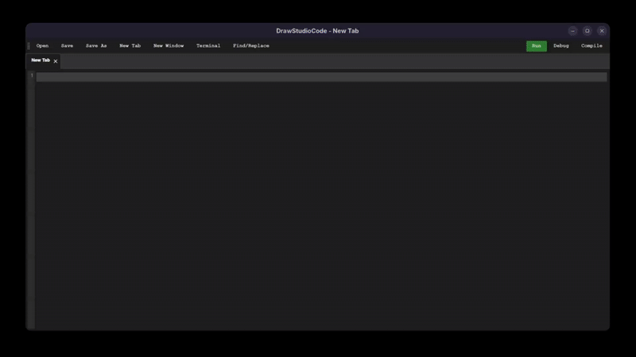
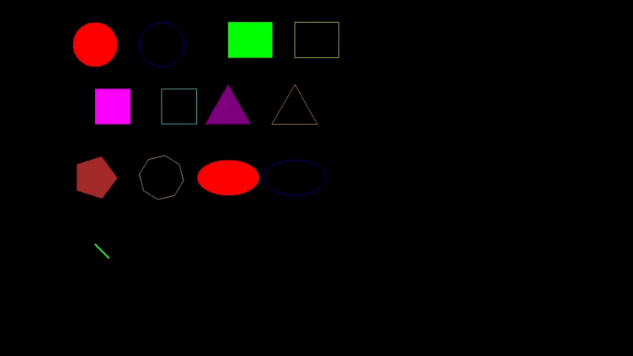

# Draw++ (Cy-Sketch)

> An integrated development environment for creating interactive graphic animations with a simple and intuitive language.

## 📝 Description

Draw++ consists of three main modules working together:

### 🎨 SDL Module (Graphics Engine)

- Geometric shapes management (circle, rectangle, line, polygon, etc.)
- Advanced animation system (rotation, zoom, color, bounce)
- Collision and interaction handling
- Two game modes: Escape and Defense
- Adaptive user interface

### 🔧 Compiler Module

- PLY-based Lexer and Parser
- Draw++ to C code translation
- Smart error handling with suggestions
- Variable and function support
- Interactive and file modes
- Debug mode for development

### 💻 IDE Module

- Modern and intuitive graphical interface
- Syntax highlighting, dynamic color attribute highlighting
- Simultaneous window and tab opening
- Integrated terminal with color-coded output
- Built-in keyboard shortcuts
- Search/Replace functionality
- Auto-save feature
- Movable and modular menu bar
- Ability to kill running processes

## 📸 Screenshots

### IDE Interface


### Execution Result


## 🚀 Installation

### Main Prerequisites (obtained during setup below)

- Python 3.6+
- SDL2 and its extensions (SDL2_gfx, SDL2_ttf)
- GCC (for C compilation)
- PyQt5 (for IDE)

### Installation

1. Clone the repository:

```bash
git clone https://github.com/NayJi7/cy-sketch
```

2. Install dependencies:

- On Ubuntu:

```bash
cd Draw++/SETUP
./setup.sh
```

- On Windows:

```
Go to Draw++/SETUP
Run setup.bat as administrator
```

## 🎮 Usage

1. Launch the IDE:

```bash
We recommend to launch our ide with its executable after generating it with setup.sh/bat (you can also browse it in your apps)

Launch the .exe created by setup on Windows (at project root or in your applications)
Launch the executable created by setup on Ubuntu (at project root or in your applications)

Via Python (in Draw++/): python3 ide.py
```

2. Create a new .dpp file
3. Write your Draw++ code (see Example.dpp)
4. Execute and enjoy!

### Code Example:

```
draw circle(animated, filled, red, 100, 100, 50)
draw rectangle(instant, empty, blue, 200, 200, 100, 50)
set window color(black)
set window title("Draw++")
set window size(800, 600)
```

## 🎯 Main Features

### Supported Functions

- **draw**

  - circle (mode, fill, color, centerX, centerY, radius)
  - rectangle (mode, fill, color, x, y, width, height)
  - square (mode, fill, color, x, y, sideLength)
  - polygon (mode, fill, color, centerX, centerY, radius, sides)
  - triangle (mode, fill, color, centerX, centerY, radius)
  - arc (mode, color, centerX, centerY, radius, startAngle, endAngle)
  - line (mode, color, x1, y1, x2, y2, thickness)
  - ellipse (mode, fill, color, centerX, centerY, radiusX, radiusY)
- **set**

  - cursor
    - size(size)
    - color(color)
  - window
    - size(width, height)
    - color(color)

### Basic Features

* **Loops**
  * while (condition) { block }
  * do { block } while (condition)
  * for (initialize; condition; increment) { block }
* **Conditions**
  * if (condition) { block }
  * elif (condition) { block }
  * else (condition) { block }
* **Variable/Function Declaration and Usage**
  * var name = value
  * name = value
  * func myfunction (int a, float b, char c[size]) { block }
  * myfunction (arguments)
* **Comments**
  * Single line: # comment
  * Multi line: /* comment */
* **Operators**
  * Arithmetic (+, -, *, /)
  * Logical (or, and, ==, !=, <, >, <=, >=)
  * Boolean (true, false)

### Interactions

- **Rotate** left (q) / right (d)
- **Select/Deselect shape** (click / e)
- **Move shape** (mouse movement or arrow keys)
- **Zoom shape** in (*) / out (/) (scroll wheel)
- **Animation selection** (+) (-)
- **Apply animation** (enter)
- **Remove animation** (delete)
- **Launch animation** **list** (a)
- **Change shape layering** (z) (s)
- **Reset size, zoom and color** (r)
- **Stop all animations** (n)
- **Delete shape** (del / suppr)
- **Game mode** (g)
  - **Game selection** (g)
  - **Quit** (space)
  - **Start game** (enter)
- **Quit** (escape)

### Animations

These animations can be applied simultaneously and differently for each shape (3 animations max per shape)

* **Rotate**
  * A rotation effect
* **Zoom**
  * A zoom in and out effect
* **Color**
  * Color changing effect
* **Bounce**
  * A bouncing effect making the shape move across the screen and bounce off edges

### Game Modes

1. **EscapeShapes**: Capture the escaping shapes
2. **DefenseShapes**: Protect your shapes from projectiles

## 👥 Contributors

<a href="https://github.com/NayJi7/cy-sketch/graphs/contributors">
  
</a>
